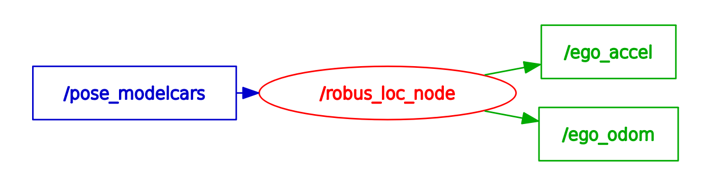
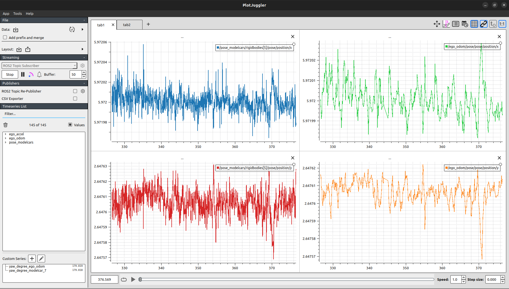
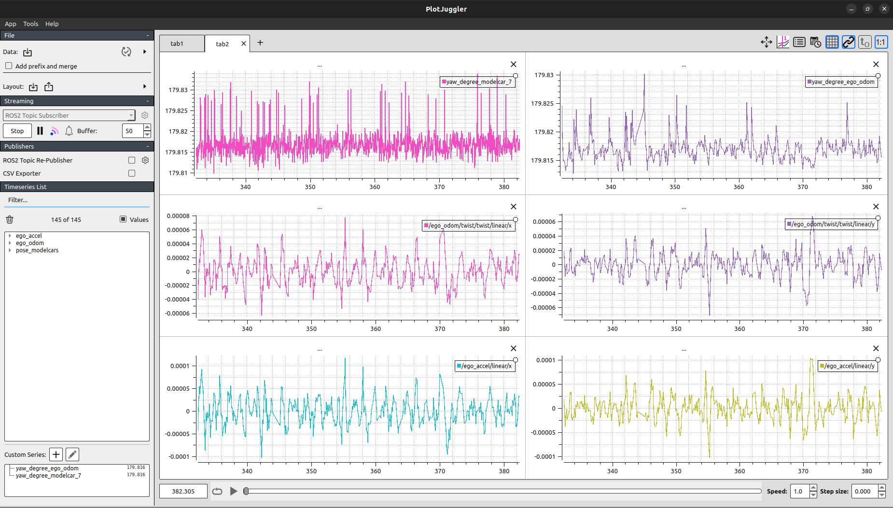
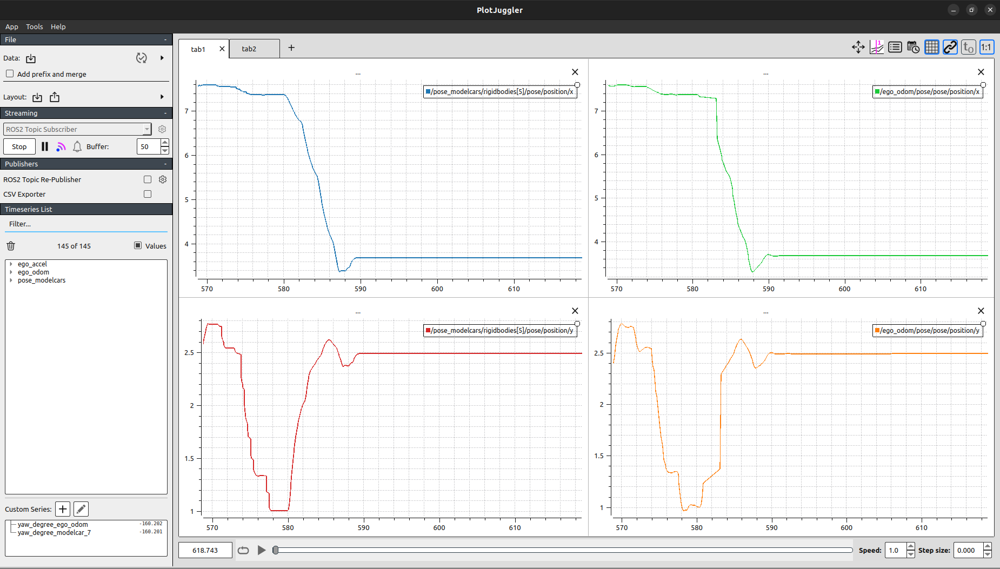
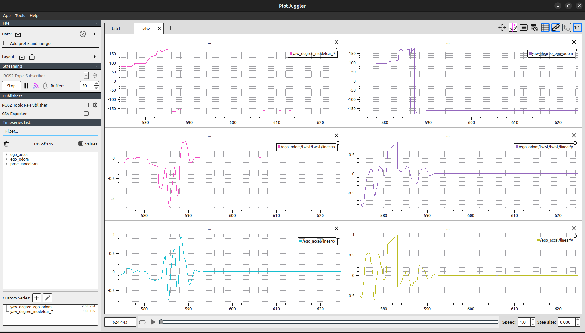

# Localization


## Description
Localization involves determining the shuttle's precise position,orientation,velocity and acceleration which is critical for safe and efficient autonomous navigation. Leveraging the OptiTrack system within ModelCity, the shuttle obtains accurate local coordinates, which are then precised using the Kalman Filter to estimate its true state within the environment. This enables the shuttle to maintain lane discipline, follow predefined routes, and make reliable navigation decisions. The high precision of this system reduces trajectory planning errors, enhances operational reliability, and ensures a smooth, safe, and predictable ride for passengers.

## Author
**Aswath Subramanian**

## Input
| Description | Topic Name |ROS2 Message |
|--------------|---|--------------|
|Localization data from OptiTrac System | /pose_modelcars | [geometry_msgs/msg/PoseStamped](https://docs.ros2.org/foxy/api/nav_msgs/msg/Odometry.html) |

## Output
| Description | Topic Name |ROS2 Message |
|--------------|---|--------------|
| Precise pose and velocity of the ego vehicle (position and orientation) in local coordinates | /ego_odom | [nav_msgs/msg/Odometry](https://docs.ros.org/en/ros2_packages/humble/api/geometry_msgs/interfaces/msg/Pose.html) |
| Precise acceleration of the ego vehicle | /ego_accel | [geometry_msgs/msg/Accel](https://docs.ros.org/en/noetic/api/geometry_msgs/html/msg/Accel.html) |

## Instructions

To run the Localization node follow the instructions below,
1. Create a ros2 workspace and clone the following repositories.

```
git clone https://git.hs-coburg.de/ROBUS/robus_localization.git
git clone https://git.hs-coburg.de/Aswath/mocap_msgs.git
```

2. Install Plotjuggler for visualization
```
sudo apt install ros-$ROS_DISTRO-plotjuggler
```

3. Build and Source the files

```
colcon build
source install/setup.bash
```
4. Run the Localization node for publishing the Pose and Velocity of the ego_vehicle.

```
ros2 run robus_loc localization_node
```

## Visualization

To visualize the Component Interface in the node graph, use the following command.

```
rqt_graph
```

<div align= "center">
    
</div>
<br>

To visualize the live plot, using OptiTrack in ModelCity or Recorded rosbag file, use the respective commands.

- Navigate to resource file
```
cd resource
```
- In ModelCity
```
ros2 run plotjuggler plotjuggler -l modelcity_plot_values.xml
```
- With Rosbag file
```
ros2 run plotjuggler plotjuggler -l rosbag_plot_values_ID7.xml
```

### Ideal State

- Position X and Y comparision
<div align= "center">
    
</div>
<br>

- Yaw comparision, Velocity and Acceleration visualization

<div align= "center">
    
</div>

### Moving State

- Position X and Y comparision
<div align= "center">
    
</div>
<br>

- Yaw comparision, Velocity and Acceleration visualization

<div align= "center">
    
</div>
